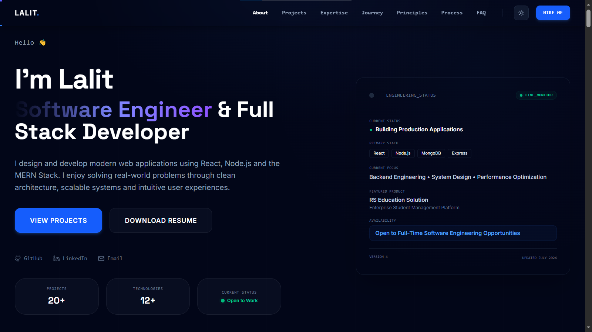

<div align="center">

# Lalit Portfolio

### Software Engineer & Full Stack Developer

Modern portfolio showcasing full-stack projects, engineering case studies, scalable architecture, and production-ready web applications.

<p>

<a href="https://lalit-portfolio-gamma.vercel.app">🌐 Live Demo</a> •
<a href="https://github.com/lalit2406/lalit-portfolio">💻 Source Code</a> •
<a href="https://www.linkedin.com/in/lalit-kumar-web/">LinkedIn</a>

</p>

</div>

---

# Portfolio Preview



---

# About

This portfolio showcases my work as a Software Engineer and Full Stack Developer, with a focus on building scalable, production-ready web applications using modern technologies.

The portfolio demonstrates my approach to clean architecture, responsive UI development, performance optimization, accessibility, and real-world software engineering.

---

# Features

- Modern responsive UI
- Engineering case studies
- Interactive project showcase
- Smooth animations with Framer Motion
- Performance optimized
- Accessibility focused
- SEO optimized
- Resume download
- Contact form

---

# Tech Stack

### Frontend

- React
- Vite
- JavaScript (ES6+)
- Tailwind CSS
- Framer Motion

### Backend

- Node.js
- Express.js

### Database

- MongoDB

### Tools

- Git
- GitHub
- Vercel
- EmailJS

---

# Featured Projects

## RS Education Solution

Enterprise student management platform with authentication, dashboards, forms, analytics, and document workflows.

---

## AgriTech Analytics

Agriculture platform providing analytics, weather insights, dashboards, and modern UI.

---

## UNO Multiplayer

Real-time multiplayer UNO game built with responsive gameplay and modern frontend architecture.

---

## Food Delight

Responsive food ordering platform focusing on user experience and clean interface design.

---

# Getting Started

```bash
git clone https://github.com/lalit2406/lalit-portfolio.git

cd lalit-portfolio

npm install

npm run dev
```

---

# Build

```bash
npm run build
```

---

# Live Website

https://lalit-portfolio-gamma.vercel.app

---

# Connect With Me

**Portfolio**

https://lalit-portfolio-gamma.vercel.app

**LinkedIn**

https://www.linkedin.com/in/lalit-kumar-web/

**GitHub**

https://github.com/lalit2406

---

## License

This project is available for learning and portfolio reference.